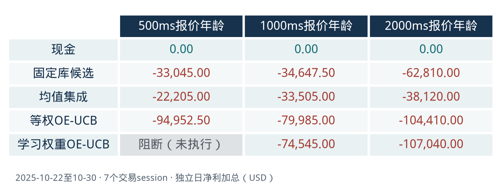

## **[术语词典（glossary）](glossary.md)：用通俗语言解释 UCB、OE、IRL 等缩写和项目术语，附论文出处或代码位置。初读者先看8个核心词，其余按需查阅。**

# 从固定模型到动态选模型：FMATO 的课程部分复现

本项目用于 **10分钟小组展示**。我们研究：在相同交易与成本条件下，用多尺度成交后评价动态选择预测模型，是否比固定模型和简单集成更有效？原方法见 [论文](1679894.pdf)。

目前实现了轻模型库、历史奖励校准、期间 UCB 选择和因果交易回放。现有七日复核中，所有已执行的非现金策略累计亏损，学习权重的改善方向也不稳定。因此结论是完成核心机制的部分复现，当前结果没有支持稳定收益优势。

组员按下面的顺序准备即可，无需阅读源码、配置和原始 JSON：

1. 阅读本页的数据介绍，再用 [简短课程报告](final_replication_report.md)理解方法、实验条件和结论边界。
2. 根据报告的主表和两张图，由组员分工制作 PPT 与讲稿；展示沿着“问题→方法→实验→结果→局限”展开，并计时排练。



上图是2025-10-22至10-30的七个交易 session，单位为美元。500ms是快照网格；横轴500/1000/2000ms是允许的报价年龄。灰格“阻断”没有收益观察，不能读作现金的零收益。各日账户独立重启，图中金额是日利润加总。

## 数据集

ESZ5 行情的下载入口为 [Hugging Face 数据集 badraldine/datamining_hft_SUFE](https://huggingface.co/datasets/badraldine/datamining_hft_SUFE)，本地按 `data/ESZ5/` 结构存放。下面的日期、条数和质量状态来自 `data/ESZ5/index.json`：

| 项目 | 说明 |
| --- | --- |
| 来源 | Databento 的 `GLBX.MDP3` 数据集，提供 CME Globex 行情 |
| 标的 | `ESZ5`：CME E-mini 标普500股指期货的2025年12月合约；本项目使用单一合约，合约代码规则见 [CME 说明](https://www.cmegroup.com/education/courses/introduction-to-futures/understanding-contract-trading-codes) |
| 数据内容 | [MBP-10 十档盘口](https://databento.com/docs/schemas-and-data-formats/mbp-10)：按价格聚合的买卖各十档报价、挂单数量和订单数，以及事件时间、接收时间等；行情消息包含盘口更新与成交事件 |
| 原始覆盖 | 2025-09-15至2025-12-15（末日不含），78个有文件的 UTC 日期，共714,385,685条行情消息（约7.14亿条） |
| 质量状态 | 2025-09-17、09-24、11-28标记为 `degraded`（源数据质量降级）；当前重跑协议默认排除降级日期 |
| 本地组织 | `parquet/` 存放按 UTC 日期划分的表格数据，`dbn/` 保留源格式文件，`index.json` 记录覆盖与质量；原始行情不提交 Git |

可以把盘口理解为“市场此刻愿意买、愿意卖的价格与挂单量”。项目选取前五档，每500ms生成一张当时已经收到的完整盘口快照，再构造价格与挂单深度特征。挂单数量描述待成交的深度，实际成交量另有含义。

**数据覆盖范围与实验范围分别说明。** 现有证据涉及21个交易 session（交易日）：初始训练2日、历史奖励校准5日、开发评价7日、冻结复核7日；模型按周使用当时已结束的历史日更新。主展示使用2025-10-22至10-30的最后七日，**没有完成全季度回测**。UTC文件日期与交易日的夜盘边界不同，一个完整交易日可能跨相邻文件。全部实验日期已用于开发，不能追认未触碰的测试集；CME股指期货与论文中国商品期货市场也有差异。

两份早期根目录 Parquet、旧报告、旧看板及其批次产物已退出当前版本。仓库保留新数据路线的既有证据、课程摘要和图表，查看它们无需原始行情；重新处理数据时需要本地 `data/ESZ5/`。

## 查看与运行

查看和核对结果只需要 Python，无需下载行情：

```bash
python run_project.py
python -S scripts/check_project.py
```

维护者推荐使用 Python 3.12，安装 `requirements.txt`。若已有虚拟环境，使用 `.venv/bin/python`：

```bash
# 加做合成数据的因果性、成熟时序和账本检查。
python run_project.py check --core
# 导出结果素材（摘要与两张图），输出必须是新目录。
python run_project.py export --output-dir /tmp/course-export
# 完整重跑较耗时；只处理唯一协议所需日期，另存新数据和结果。
python run_project.py prepare --output-dir /tmp/course-inputs
python run_project.py run --prepared-dir /tmp/course-inputs --output-dir /tmp/course-replay
```

默认查看和导出均使用既有证据，不能称为新代码重跑收益。唯一协议是 [course_experiment.json](config/course_experiment.json)；源码位于 `src/`。历史三份快照与两张图在 [证据目录](results/final_report/README.md)按原字节保留，其中也包含 ME、ARS、不利结果与失败状态，不属于组员的默认阅读任务。删减前版本可通过提交 [0338afc](https://github.com/Michelia-L/data-mining-hft/tree/0338afc2e8a67ee22285d05d41e4d78373329859)追溯。
