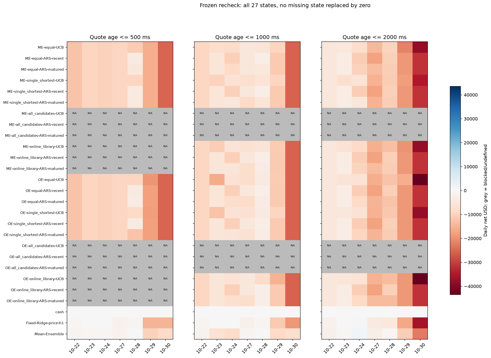
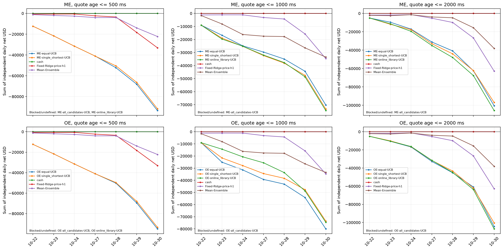

# FMATO 方法的课程部分复现报告

**状态：收尾4/4定稿，2026-10-05。** 已完成开发证据、最小ME/OE四组合、
七日冻结复核、赋权消融、同源图表和交付核对。证据与复核入口见
[交付索引](results/final_report/README.md)及[最终验证记录](docs/final_delivery_validation_2026-10-05.md)。
这是一份CME替代数据上的部分复现报告，不声称复现论文原始收益或实盘。

## 摘要

FMATO将预测模型选择视为强化学习动作，通过轻模型库、多尺度价格差奖励、
逆强化学习与UCB/ARS实现在线调整。本项目以CME ESZ5行情代替论文中国
商品期货数据，实现因果定时快照、不同特征/历史期的轻模型库、七尺度ME/OE
奖励学习，以及固定期间UCB和两种历史窗口ARS工程口径。

研究保留三种报价年龄、两种工程专家来源和双ARS口径。原OE开发评价共
24策略、504策略日；四组合在同一七日增加ME与均值集成，扩为34策略、
714策略日，其中546执行、168阻断。四组合的旧24项继承原结果，不能把
504与714相加解释为更多独立回放。库内ME专家仅有2/11个成熟预测信号。

随后在读取收益前声明首七个后续session，冻结旧奖励、门控与全部参数，
按既定规则因果更新周模型。27项赋权及必要参照共567策略日，399执行、
168阻断，执行日均已平仓。各年龄非现金策略七日累计均亏损，学习权重
相对等权的改善方向不一致；部分少亏主要来自摩擦减少，不能证明预测改善。

现有证据支持多周因果执行链路、身份追溯与有限消融的工程实现，尚不支持
学习奖励稳定改善收益。原开发与冻结复核都没有未触碰测试声明；ME聚合、
有限策略IRL、短历史和双ARS成熟衔接为项目假设，未复现原品种、生产策略、
完整基线或实盘数值。报告以负结果和明确限制交付部分复现。

## 1. 研究问题与复现目标

原论文为Zhang等人的《Auto tuning of price prediction models for
high-frequency trading via reinforcement learning》，发表于Pattern
Recognition 125（2022），108543，原文见[1679894.pdf](1679894.pdf)。
本报告依据物理第3–5页§3、Eq.(1)–(6)、Algorithms 1–3，以及第5–10页
实验设计、Tables 3–11和Figs. 5–9；本轮报告编写前重新阅读了相关原文。

论文希望通过不同轻模型适应变化的市场，并通过长短尺度奖励指导模型选择。
本课程项目关注三个能够检验的问题：多周模型选择是否因果执行；学习奖励
能否提供可用反馈；在可比执行成本下，动态选择是否优于必要参照。
复现完成不以盈利为前提。替代市场上的失败也不能据此反驳论文原市场结论。

## 2. 原论文方法与实现对应

### 2.1 动作和轻模型库

Eq.(1)将选择模型对应为动作。§3.2以不同特征集和历史时期训练线性回归
或决策树，并按周更新。本项目库含12个候选：两种算法×三组工程特征
（价格、盘口展示量、价格与量组合）×最近1/2个完整session。
不同特征类别对应Table 2，但具体特征、短历史和树参数是项目设定。

模型在每个ISO周首个声明session开盘更新，仅使用此前已经结束的历史及
成熟标签；在评价周内不因收益表现替换参数。静态库参照固定的是候选ID，
数值模型仍按周更新；原固定Ridge参照则保留启动训练参数，两者需区分。

### 2.2 多尺度奖励和有限策略学习

Eq.(2)定义中间价差`E_t(T)=m_(t+T)-m_t`，单位为价格点；Eq.(3)–(4)
将多尺度期望线性组合，要求权重和为1。项目使用
`T=[5,15,45,135,405,1215,3645]`秒，最长超过一小时。
本项目以买卖方向符号乘价格差来评价订单，卖单符号处理是明确的项目扩展；
不对奖励归一化、裁剪或扣交易成本。含负权允许于仅等式约束，非负约束
不是论文的明文要求。

Algorithm 1要求从回测获得专家、优化奖励，并调用策略优化器反复改进策略。
原文未公开专家候选范围和生产优化器。项目使用完整有限候选矩阵的最大
间隔求解与最优面最小L1消歧，并同时保留非负单纯形、有界负权和仅等式
三种诊断。仅预声明的`sum_only`约束进入本轮执行，不根据后段收益选择。
这是一种工程近似，收敛不等于复现生产优化器，也不等于奖励唯一可识别。

专家来源并列保留全候选和库内候选；均按校准净利选取，不更换没有成熟
奖励的最佳专家。现金是全候选参照，但不在在线模型动作空间中。完整库
缺成熟评价、最佳专家无成熟OE或专家在动作空间外时保留阻断，不补零收益。

### 2.3 期间评价和选择

Eq.(5)是固定期间的订单平均奖励。项目每5分钟选择一次模型，期间评价
包含该模型在该期间的全部成交订单。任何订单失效或尚未成熟，该期间
不能用成熟子集更新选择器。校准则按成熟订单子集计算候选均值，两种统计
总体不同，不能把校准可学直接解释为在线反馈充分。

UCB沿用Eq.(6)的平均奖励和探索项，`C=1`价格点是既有项目设定。
ARS沿用Algorithm 3过去30分钟回测其他模型的结构，但论文未解释30分钟
窗口如何获得最长超过一小时的完整奖励。项目分别保存严格最近窗和向前
平移最长前瞻的成熟窗，冷启动时按既定规则轮换。两者都是明示工程口径，
不宣称是论文原系统的等价实现。

真实时间ME在预测时刻筛出超过既有阈值的非零方向信号，期间内全部信号
的七尺度向量成熟后取均值，单位仍为价格点；这是原文未公开聚合的项目假设，
不是Eq.(5)订单均值。ME-ARS对其他模型重建同窗口预测特征并评价全部信号，
仍保留严格最近与平移成熟两种口径。ME反馈与成交无关，先因果推进选择，
再将每个当前时刻的模型送入原执行器；美元成本、延迟和持仓处理相同。

### 2.4 忠实度边界

| 项目 | 原文依据 | 本项目当前状态 |
| --- | --- | --- |
| 模型作为动作 | 第3页Eq.(1) | 按该定义构建动作空间 |
| 特征/历史期模型库、周更新 | 第3–4页§3.2、Table 2 | 结构已实现，具体特征及1/2session历史为工程设定 |
| 原始中间价差、权重和为1 | 第4页Eq.(2)–(4) | 使用七尺度价格点；卖方向符号、专家来源、有限优化另作说明 |
| 固定期间订单均值 | 第5页Eq.(5) | OE在线完整期间均值已实现；校准子集和在线全集分开 |
| UCB与历史回测ARS | 第5页Algorithms 2–3 | 固定期间实现；延迟反馈、窗口衔接与冷启动为工程假设 |
| ME与OE四变体 | 第5–7页§3.3.1–§4.2 | ME/OE×UCB/双ARS均有执行或阻断；ME筛选/聚合为工程假设 |
| 三个月数据、末月测试 | 第5、7页§4.1–§4.2 | 原14session开发加七日冻结复核；均无未触碰声明，不满足原设计 |
| 奖励消融与集成基线 | 第7–8页§4.4–§4.5、Tables 8–11 | 等权/单尺度赋权/学习及均值集成已对照；独立短成熟、当前tick、最佳单模型与准确率赋权集成未复刻 |
| 完整链路每tick耗时 | 第7–8页§4.3、Tables 6–7 | 未获得行情接收至发单的可比耗时；单条预测/离线总耗时不能替代 |
| 中国期货实盘和收益数值 | 第5–10页§4 | CME替代回放；没有原品种、实盘或原收益数值复现 |

详细历史对应见[paper_alignment.md](docs/paper_alignment.md)。早期
`CausalEventUCB/CausalShadowARS`的事件级结果保留在
[历史报告](replication_report.md)，不混入下文真实时间策略表。

## 3. 数据与时间协议

### 3.1 数据范围和质量

数据来自本地Databento GLBX.MDP3的ESZ5 MBP-10 UTC源分区，原始行情
由[项目数据集](https://huggingface.co/datasets/badraldine/datamining_hft_SUFE)
提供。原开发实验使用18个源分区、157,057,286条消息，构成14个声明
交易session；数据准备证据见[多周就绪验证](docs/multiweek_readiness_validation_2026-10-02.md)。
冻结复核另用12个必要UTC分区，其中四个快照分区复用、八个新准备；
构成七个后续评价session和必要的已结束训练历史，日期见§3.2及
[准备记录](docs/frozen_ablation_validation_2026-10-05.md)。旧18分区的消息
数只属于原批次，不冒称后段总消息数。不能把UTC文件日期当作交易日，
也不能把原始消息条数当作论文tick数。

决策网格为500ms，仅使用当时已收到的完整盘口，按质量标志、接收时间和
报价年龄筛选。源分区齐全不代表500ms网格无缺口；已评估session都有
筛选后缺口。标签须有精确目标网格且在同一连续区段，长空档不前填。
不纳入前缀预览或degraded输入。该处理减少样本，但避免虚构连续时间。

论文第3页称通常0.5秒一个tick，第5页实验说明又称每秒四次快照；本项目
采用0.5秒，是公开的复现假设，不能称其为论文唯一完整频率。

### 3.2 切分和信息可见性

原开发阶段（§5.1–§5.4）采用以下日期；校准仅消费该阶段五日历史。

| 阶段 | 2025年trade date | 用途 |
| --- | --- | --- |
| 启动训练 | 10-02、10-03 | 初始模型；最长3645秒purge处理边界 |
| 奖励校准 | 10-06至10-10 | 16个静态候选回放；按成熟订单数合并并冻结奖励 |
| 开发验证 | 10-13至10-17 | 24项策略状态、收益和时序审计 |
| 开发测试 | 10-20、10-21 | 冻结奖励后评价；仍为开发用途 |

这些日期都已用于开发，不能声称最后两日未被触碰。实际周模型于10-06、
10-13和10-20可用；只有后两个版本计为动态评价覆盖。决策只能使用最新
可见版本，未来价格只用于离线标签或成熟后的奖励。七尺度全部成熟才有
反馈，即使某些权重为零也不缩短最长前瞻。

继承的session协议备注描述了早期“仅预测就绪检查”；原OE冻结动态计划
以`stage_roles`显式将后段扩为动态开发评价。快照同时保留旧协议和动态
阶段角色、奖励更新、账户和激活政策，不能把旧备注当作动态评价定义。

冻结复核（§5.5）的时间安排如下，不与上表合成一个静态四段切分：

| 周版本/用途 | 2025年trade date | 可用信息与规则 |
| --- | --- | --- |
| 10-20初版 | 10-16、10-17训练 | 全部数值参数继承旧版；1session只用17日，2session用16/17日 |
| 前周评价 | 10-22、10-23、10-24 | 旧版预测、旧五日奖励；不重新校准 |
| 10-27周更新 | 10-23、10-24训练 | 只用已结束且标签成熟历史；1session只用24日，2session用23/24日 |
| 后周评价 | 10-27、10-28、10-29、10-30 | 更新后的模型、同一冻结奖励与执行参数 |

23/24日先评价，结束后成为27日训练历史，是预声明在线适应；不能提前用于
22日至24日决策。协议容器`train`是逐版训练日并集，真正可见性由版本与
训练审计确定。两批共涉及21个不同session，核心动态评价各七日；均不
主张未触碰测试。后段7日、12个源分区和旧14session/18分区是不同总体。

### 3.3 单位和执行成本

| 量 | 设定 | 单位/含义 |
| --- | --- | --- |
| 网格间隔 | 500 | ms，不是消息数或价格跳动 |
| 最大报价年龄 | 500、1000、2000 | ms；全部保留，不按后段收益选年龄 |
| 预测前瞻 | 5000 | ms |
| 奖励前瞻 | 5000至3645000，共七项 | ms；原始中间价差奖励 |
| 选择期间 | 300000 | ms，即5分钟 |
| ARS历史窗口 | 1800000 | ms，即30分钟 |
| 执行延迟 | 500 | ms；到达后使用实际可用盘口 |
| 持仓复核 | 15000 | ms，实际持仓可因同向信号延长 |
| 交易门槛 | 0.000015 | 预测收益阈值，沿用既有配置 |
| 合约乘数/最小价格跳动 | 50/0.25 | USD每价格点/价格点 |
| 手续费/不利滑点 | 1.25/0.5 | USD每订单/价格跳数 |

一手主动成交，按实测点差、不利滑点和手续费扣成本。毛盈亏以中间价
账本计，摩擦为上述成本总和，净盈亏=毛盈亏−摩擦。奖励为价格点，利润
为美元，两者不能混读。未模拟排队、部分成交、冲击、保证金或实盘延迟。

账户、选择器和队列每天重启，每日初始资金100000美元；日结果相加仅为
独立日账户利润之和，不是连续账户复利。未平仓或不可结算的结果保留未
定义状态。归档日结果均可结算；短期样本不作年化Sharpe或年化收益推断。

## 4. 已完成实验设计

原18项控制包含等权OE-UCB、同期间轮换、现金、原固定Ridge、12个固定库
候选及两种等权OE-ARS。#19新增六项OE学习状态，为两种专家来源各自的
UCB/双ARS；收尾2/4再预声明新增均值集成、三项ME等权和六项ME学习，
共34项。ME样本和完整反馈规则先冻为配置，再计算新ME校准和评价收益。
所有年龄、来源、权约束诊断、失败和负结果保留，不按表现过滤。

两种来源使用同一完整候选矩阵，只有专家筛选范围不同。所有奖励在五个
校准日结束后拟合一次，随后不重学。周模型可按已声明规则使用当时已有
历史，不能在看到评价收益后调整阈值、年龄、奖励或专家规则。

动态策略要求当下全部库候选可预测，静态候选按自身可用性交易，沿用
既有对照口径。交易次数差异不能全部归因于模型选择。上一轮ME和均值
集成保持全部库候选当前可用规则，ME/OE统计总体及工程假设在§5.4说明。

| 证据批次 | 评价日期（2025年） | 策略/策略日 | 用途与继承关系 |
| --- | --- | --- | --- |
| 原OE开发 | 10-13至10-21的七个session | 24/504 | 原研究结果及静态参照 |
| 最小四组合 | 同七个session | 34/714 | 原24项继承，新增10项ME/集成状态 |
| 冻结复核 | 10-22/23/24/27/28/29/30 | 27/567 | 全部重放；仅增赋权消融与三必要参照 |

冻结复核继承旧校准，等权与单尺度在收益前声明；每年龄完整保留ME/OE、
两专家来源和双ARS。该批次三参照也要求全部库预测可用，以统一本次可用性，
与旧静态候选按自身可用性执行不同；跨批次盈亏不能作为单一奖励因果效应。
表内策略日是执行或阻断的状态条目，不是独立统计样本，也不能直接相加
称为不重复回放数量。

## 5. 真实多周开发结果

§5.1–§5.3为原OE开发证据，§5.4为同阶段ME/四组合，§5.5为七日冻结复核。

### 5.1 专家资格和冻结奖励

| 报价年龄 ms | 全候选来源 | 库内来源 | 库内专家净利 USD | 专家成熟订单/成交数 |
| --- | --- | --- | --- | --- |
| 500 | 最佳专家无成熟OE，阻断 | 最佳专家无成熟OE且库覆盖不完整，阻断 | -8842.50 | 0/834 |
| 1000 | 现金在动作空间外，阻断 | 通过原门控 | -10487.50 | 4/840 |
| 2000 | 现金在动作空间外，阻断 | 通过原门控 | -2212.50 | 22/120 |

1000ms库内专家为`Library-Ridge-price-h1`，2000ms为
`Library-Ridge-price_volume-h2`。两者均亏损，1000ms仅四个成熟订单。
通过门控只说明预设计算条件满足，不能解释为专家有盈利优势或样本充分。

按七尺度顺序，冻结权重分别为`[0,0,0,0,0,1,0]`和
`[0.4594281745572404,0.279546243778215,0,-0.09248755643014231,0.3535131380946869,0,0]`。
完整三约束拟合、并列专家及门控原因保存在仓库证据快照中。

### 5.2 学习组收益和必要参照

| 策略 | 500ms七日净利 USD | 1000ms七日净利 USD | 2000ms七日净利 USD |
| --- | --- | --- | --- |
| 现金 | 0.00 | 0.00 | 0.00 |
| 等权UCB | -110215.00 | -105730.00 | -139520.00 |
| 库内学习OE-UCB | 阻断 | -99247.50 | -142930.00 |
| 等权ARS严格最近窗 | -101447.50 | -93852.50 | -159700.00 |
| 库内学习OE-ARS严格最近窗 | 阻断 | -93852.50 | -159700.00 |
| 等权ARS平移成熟窗 | -97172.50 | -101737.50 | -153025.00 |
| 库内学习OE-ARS平移成熟窗 | 阻断 | -105845.00 | -142912.50 |

原全候选学习组三策略在全部年龄下都阻断，其收益为null，不与现金0混同。
库内学习UCB在1000ms比等权少亏6482.50美元，在2000ms比等权多亏
3410.00美元；平移ARS的变化方向也不一致。本结果不支持学习权重稳定
改善收益。该OE批次全部执行的非现金策略在各年龄的七日累计净利均为负。
全部24策略和固定库参照见文末表，不只保留选中的动态策略。

### 5.3 毛利、成本和反馈覆盖

| 库内学习策略 | 年龄 ms | 七日毛利 USD | 七日摩擦 USD | 七日净利 USD |
| --- | --- | --- | --- | --- |
| UCB | 1000 | -4606.25 | 94641.25 | -99247.50 |
| ARS严格最近窗 | 1000 | -5256.25 | 88596.25 | -93852.50 |
| ARS平移成熟窗 | 1000 | -4812.50 | 101032.50 | -105845.00 |
| UCB | 2000 | 1550.00 | 144480.00 | -142930.00 |
| ARS严格最近窗 | 2000 | -1450.00 | 158250.00 | -159700.00 |
| ARS平移成熟窗 | 2000 | -4081.25 | 138831.25 | -142912.50 |

可执行库内学习组在两个评价周都实际选择了模型版本。1000ms每个策略
共选择1835次，2000ms为1910次；这比只生成两个周版更直接地证明动态
执行覆盖，但不等于获得同样数量的有效反馈。

| 年龄 ms | 学习UCB完整成熟期间桶 | 学习最近ARS完整成熟期间桶 | 学习平移ARS完整成熟期间桶 | 学习平移ARS可评分/全部历史窗 |
| --- | --- | --- | --- | --- |
| 1000 | 58 | 67 | 59 | 453/20185 |
| 2000 | 79 | 96 | 82 | 578/21010 |

完整期间桶数与选择次数不是同一总体，不能把其比值称为反馈概率。
严格最近窗可评分历史窗为0，其逐日实际选择、成交数和净利均与等权
最近ARS相同。在七尺度全部成熟约定下，30分钟最近窗无法提供满足
3645秒最长前瞻的完整订单反馈。平移窗有少量评分，多数选择仍在冷启动。

### 5.4 收尾2/4：最小ME/OE四组合

三年龄、两种专家来源和双ARS窗口都保留。下表为七日美元净利；ME与OE
的聚合样本不同，四组合名称表示工程对照，不代表原生产系统等价恢复。
OE24项继承前述独立历史结果；ME和均值集成按相同数据/周模型/未改动执行器新增回放。

| 年龄ms | 专家来源 | ME-UCB | ME-ARS最近 | ME-ARS平移 | OE-UCB | OE-ARS最近 | OE-ARS平移 |
| ---: | --- | ---: | ---: | ---: | ---: | ---: | ---: |
| 500 | 全候选 | 阻断（未观察） | 阻断（未观察） | 阻断（未观察） | 阻断（未观察） | 阻断（未观察） | 阻断（未观察） |
| 500 | 库内 | 阻断（未观察） | 阻断（未观察） | 阻断（未观察） | 阻断（未观察） | 阻断（未观察） | 阻断（未观察） |
| 1000 | 全候选 | 阻断（未观察） | 阻断（未观察） | 阻断（未观察） | 阻断（未观察） | 阻断（未观察） | 阻断（未观察） |
| 1000 | 库内 | -101135.00 | -93852.50 | -93855.00 | -99247.50 | -93852.50 | -105845.00 |
| 2000 | 全候选 | 阻断（未观察） | 阻断（未观察） | 阻断（未观察） | 阻断（未观察） | 阻断（未观察） | 阻断（未观察） |
| 2000 | 库内 | -124535.00 | -159700.00 | -144270.00 | -142930.00 | -159700.00 | -142912.50 |

ME校准的专家仍按同16候选完整美元净利选取，权重只消费校准成熟预测信号。
原文未公开ME聚合与极端信号筛选，四组合采用既有5秒相对收益预测阈值
`1.5e-5`，以预测方向乘七尺度原始价格点差；未恢复极端千分位筛选。
校准按成熟信号数合并子集，在线期间/历史窗则要求全部信号成熟，不用
成熟子集替代分母。最低信号数仅为计算资格，不代表统计充分。

| 年龄ms | ME专家来源 | 拟合状态 | 专家 | 专家成熟信号/过阈值信号 | 门控 |
| ---: | --- | --- | --- | ---: | --- |
| 500 | 全候选 | blocked_expert_reward_unobserved | Ridge-threshold-x4 | 0/2 | 阻断 |
| 500 | 库内 | blocked_expert_reward_unobserved | Library-Ridge-price-h1 | 0/2583 | 阻断 |
| 1000 | 全候选 | fitted_expert_not_representable | cash | 0/0 | 阻断 |
| 1000 | 库内 | fitted | Library-Ridge-price-h1 | 2/2385 | 通过 |
| 2000 | 全候选 | fitted_expert_not_representable | cash | 0/0 | 阻断 |
| 2000 | 库内 | fitted | Library-Ridge-price_volume-h2 | 11/67 | 通过 |

完整三约束拟合、权重、门控原因、逐日收益和审计见
[four_combinations_snapshot.json](results/final_report/four_combinations_snapshot.json)。

| 参照/ME等权控制 | 500ms七日净利USD | 1000ms七日净利USD | 2000ms七日净利USD |
| --- | ---: | ---: | ---: |
| 现金 | 0.00 | 0.00 | 0.00 |
| 预声明固定模型 Fixed-Ridge-price-h1 | -66142.50 | -74235.00 | -79505.00 |
| 12模型预测均值集成 | -57125.00 | -81640.00 | -231672.50 |
| ME等权UCB | -113912.50 | -95035.00 | -151975.00 |
| ME等权ARS最近 | -99395.00 | -93852.50 | -159700.00 |
| ME等权ARS平移 | -110252.50 | -99080.00 | -168437.50 |

四组合固定候选在该阶段运行前按声明顺序选为`Ridge-price-h1`，数值参数仍因果周更新；
未按已有开发收益选择最赚钱者，全部固定模型参照继续保留。集成在同一
全部模型预测可用的行取均值，不根据未来标签筛行情。

| 年龄ms | ME策略 | 完整成熟期间 | 可评分/全部历史窗 | 成熟信号/全部过阈值信号 |
| ---: | --- | ---: | ---: | ---: |
| 500 | Period-ME-UCB | 40 | 0/0 | 742/17788 |
| 500 | History-ME-ARS-recent | 38 | 0/14476 | 1007/18122 |
| 500 | History-ME-ARS-matured | 38 | 222/14476 | 1073/17415 |
| 500 | LibraryExpert-ME-UCB | 阻断 | 未观察 | 未观察 |
| 500 | LibraryExpert-ME-ARS-matured | 阻断 | 未观察 | 未观察 |
| 1000 | Period-ME-UCB | 38 | 0/0 | 580/14183 |
| 1000 | History-ME-ARS-recent | 59 | 0/20185 | 1940/19864 |
| 1000 | History-ME-ARS-matured | 42 | 480/20185 | 1343/19677 |
| 1000 | LibraryExpert-ME-UCB | 49 | 0/0 | 1945/22117 |
| 1000 | LibraryExpert-ME-ARS-matured | 53 | 463/20185 | 1962/18377 |
| 2000 | Period-ME-UCB | 84 | 0/0 | 2484/34900 |
| 2000 | History-ME-ARS-recent | 90 | 0/21010 | 3528/35783 |
| 2000 | History-ME-ARS-matured | 72 | 592/21010 | 2480/39426 |
| 2000 | LibraryExpert-ME-UCB | 72 | 0/0 | 1109/27268 |
| 2000 | LibraryExpert-ME-ARS-matured | 73 | 579/21010 | 1447/32155 |

成熟信号子集数量与完整可反馈期间/窗口数量不是同一总体，不能把大量
校准或成熟单信号解释为密集在线反馈。七日开发对照不能支持长期稳定优势，
也不构成原论文三个月数据/末月测试设计。

库内ME学习UCB在1000ms较ME等权多亏6100.00美元，在2000ms少亏
27440.00美元；平移ARS在两个年龄分别少亏5225.00/24167.50美元。
这些变化保留在对照中，但全部执行的非现金策略七日累计仍为负。专家
成熟信号仅2/11个，不能把少亏或门控通过解释为学习奖励稳定有效。

### 5.5 收尾3/4：七日冻结后段与赋权消融

在读取该段策略收益前，固定旧末日后的首七个交易session：2025-10-22/23/24/27/28/29/30。
范围与旧七日评价长度一致，包含10-20旧版和10-27后周版；不根据收益选择日期。
后周只用已结束23/24日训练，原1/2session历史与全部参数沿用；奖励与失败门控
逐值继承10-06至10-10旧校准，不重新拟合或替换专家。不证明此前完全未触碰，
因此称冻结后复核，不称未触碰测试或论文三个月长期评估。

预声明27项包括ME/OE各自的等权、最短尺度、全候选学习和库内学习，每组保留
UCB、严格最近ARS和平移成熟ARS；另外保留现金、固定首候选ID与均值集成。
固定候选是`Ridge-price-h1`，数值参数仍按周更新；冻结复核三参照也使用全部库
候选当前可预测规则，以统一该次可用性，不与旧单候选参照差异混作奖励效应。

Eq.(3)等权为七维人工组合，最短尺度为`[1,0,0,0,0,0,0]`，但仍等待七尺度
完整成熟。这是只改变赋权的工程消融，不等价论文§4.4只观察10tick的独立成熟
基线，也未复刻E(Current tick)；不能把差异解释成短反馈时延的贡献。

三年龄×七日×27项共567项策略日：399项执行、168项阻断。
冻结检查曾拒绝准备入口默认三尺度标签；同快照另存七尺度数据后才获准回放。
原三尺度产物与拒绝日志保留，收益前声明、日期、参数和对照均未调整。

| 年龄ms | 奖励 | 等权UCB净利USD | 最短尺度UCB净利USD | 库内学习UCB净利USD | 单尺度减等权USD | 学习减等权USD |
| ---: | --- | ---: | ---: | ---: | ---: | ---: | ---: |
| 500 | ME | -93430.00 | -91660.00 | 未定义 | 1770.00 | 未定义 |
| 500 | OE | -94952.50 | -93347.50 | 未定义 | 1605.00 | 未定义 |
| 1000 | ME | -70192.50 | -73342.50 | -74475.00 | -3150.00 | -4282.50 |
| 1000 | OE | -79985.00 | -73535.00 | -74545.00 | 6450.00 | 5440.00 |
| 2000 | ME | -100542.50 | -96970.00 | -105747.50 | 3572.50 | -5205.00 |
| 2000 | OE | -104410.00 | -100472.50 | -107040.00 | 3937.50 | -2630.00 |

全部执行的非现金策略在三个年龄下的七日累计净利仍为负。上表正差仅代表
相对少亏，学习权重改善方向不一致，不能据此证明稳定优势。成本差也不能
全部归因于奖励质量：下面把库内学习UCB减等权UCB拆为毛利与摩擦差。

| 年龄ms | 奖励 | 毛利差USD | 摩擦差USD | 净利差USD |
| ---: | --- | ---: | ---: | ---: |
| 1000 | ME | -1775.00 | 2507.50 | -4282.50 |
| 1000 | OE | -4125.00 | -9565.00 | 5440.00 |
| 2000 | ME | 2068.75 | 7273.75 | -5205.00 |
| 2000 | OE | -2331.25 | 298.75 | -2630.00 |

净利差等于毛利差减摩擦差。1000ms OE少亏伴随毛利更差、摩擦减少，不能
解释为价格方向预测改善；2000ms ME毛利改善仍不足抵消增加的摩擦。

下表的三元数按等权/最短尺度/库内学习排列，阻断仍为未观察。完整期间与
可评分历史窗的分母不同，不能直接相除当作反馈概率。

| 年龄ms | 奖励 | UCB完整成熟期间（等权/最短/学习） | 平移ARS可评分历史窗（等权/最短/学习） |
| ---: | --- | --- | --- |
| 500 | ME | 11/13/阻断 | 136/134/阻断 |
| 500 | OE | 16/14/阻断 | 130/131/阻断 |
| 1000 | ME | 70/59/55 | 440/450/457 |
| 1000 | OE | 58/61/64 | 436/441/429 |
| 2000 | ME | 55/58/76 | 538/557/552 |
| 2000 | OE | 79/74/87 | 538/533/540 |

严格最近ARS的独立历史窗评分全部为0，等权、最短与可执行学习组的最近
ARS净利相同；这不表示没有实际期间反馈，也不证明奖励权重无作用。
平移窗和UCB确有成熟反馈，但旧专家样本稀疏、成本及执行假设共同限制
解释。全部双ARS、两来源和必要参照结果见下表。

| 策略 | 500ms七日净利USD | 1000ms七日净利USD | 2000ms七日净利USD |
| --- | ---: | ---: | ---: |
| ME-equal-UCB | -93430.00 | -70192.50 | -100542.50 |
| ME-equal-ARS-recent | -86017.50 | -69852.50 | -97172.50 |
| ME-equal-ARS-matured | -87062.50 | -69860.00 | -92682.50 |
| ME-single_shortest-UCB | -91660.00 | -73342.50 | -96970.00 |
| ME-single_shortest-ARS-recent | -86017.50 | -69852.50 | -97172.50 |
| ME-single_shortest-ARS-matured | -86525.00 | -70422.50 | -89432.50 |
| ME-all_candidates-UCB | 阻断 | 阻断 | 阻断 |
| ME-all_candidates-ARS-recent | 阻断 | 阻断 | 阻断 |
| ME-all_candidates-ARS-matured | 阻断 | 阻断 | 阻断 |
| ME-online_library-UCB | 阻断 | -74475.00 | -105747.50 |
| ME-online_library-ARS-recent | 阻断 | -69852.50 | -97172.50 |
| ME-online_library-ARS-matured | 阻断 | -68042.50 | -92822.50 |
| OE-equal-UCB | -94952.50 | -79985.00 | -104410.00 |
| OE-equal-ARS-recent | -88055.00 | -69852.50 | -97172.50 |
| OE-equal-ARS-matured | -87990.00 | -70845.00 | -94437.50 |
| OE-single_shortest-UCB | -93347.50 | -73535.00 | -100472.50 |
| OE-single_shortest-ARS-recent | -88055.00 | -69852.50 | -97172.50 |
| OE-single_shortest-ARS-matured | -96845.00 | -67032.50 | -94085.00 |
| OE-all_candidates-UCB | 阻断 | 阻断 | 阻断 |
| OE-all_candidates-ARS-recent | 阻断 | 阻断 | 阻断 |
| OE-all_candidates-ARS-matured | 阻断 | 阻断 | 阻断 |
| OE-online_library-UCB | 阻断 | -74545.00 | -107040.00 |
| OE-online_library-ARS-recent | 阻断 | -69852.50 | -97172.50 |
| OE-online_library-ARS-matured | 阻断 | -69157.50 | -95040.00 |
| cash | 0.00 | 0.00 | 0.00 |
| Fixed-Ridge-price-h1 | -33045.00 | -34647.50 | -62810.00 |
| Mean-Ensemble | -22205.00 | -33505.00 | -38120.00 |

所有执行状态中若未平仓，正式累计净利保持未定义；无交易现金0与阻断分开。
完整模型、训练时序、日状态、权重、美元成本及反馈审计见
[冻结后段快照](results/final_report/frozen_ablation_snapshot.json)。



逐日热图使用统一美元色标，蓝为正、红为负，灰格不改成现金零；保留全部27项。



累计图只是独立日净利加总，账户每日重启，不是复利资金或实盘净值曲线。
曲线只展示预声明UCB赋权对照和三参照，双ARS仍全部保留在表格与日图。

## 6. 结果解释与不能作出的推断

现有实验的主要发现是：多周执行覆盖与奖励反馈充分是两件事。时间跨度
增加、奖励求解通过和程序测试通过，都不能自动形成有效的专家或密集
在线反馈。长期标签对连续行情、日内边界和成熟时序有额外要求。

摩擦成本是本协议净亏损的重要组成，部分阶段毛利为正仍不足以抵成本。
这只是固定主动成交条件下的观察。现有对照没有单独识别报价缺失、训练
历史、信号质量和执行假设各自的因果贡献，不能把全部亏损归给IRL或某个
选择器，也不能通过降低成本或改门槛反选一个盈利配置。

新增ME/OE工程四组合使用相同交易条件，但两者聚合样本与有效反馈不同，
不能把七日差异直接解释为奖励定义的长期优势。原论文使用不同市场、
合约、时段及策略细节，本项目的负结果不能直接否定论文结果。
原市场实盘、生产优化器、完整ME极端筛选、原基线与长期统计稳健性仍未
复现。原文Tables 10–11使用预测期望与准确率，本报告对照使用美元净利
及反馈覆盖，未获取完全可比的原表指标；Tables 6–7的行情接收至发单
耗时也未测得。保留这些缺失，以部分复现交付，不用其它指标替代。

## 7. 可重复性和验证

### 7.1 证据入口

[交付索引](results/final_report/README.md)说明三份快照、两张图各自的用途、
数据和源码身份及复核边界；[机器索引](results/final_report/evidence_index.json)
固定归档文件SHA和评价日期。全部证据保持研究阶段原字节，定稿不产生新收益。

原OE无需下载行情即可阅读本报告与
[development_snapshot.json](results/final_report/development_snapshot.json)。快照保留
全部年龄、专家来源、拟合/门控、分阶段统计、逐日摘要、预测/训练/动态
审计摘要与实际版本ID。它是完整结果的投影，不含每次期间/窗口回放明细，
不能单凭快照重新证明每笔成交因果性。

原OE归档快照SHA256为
`8dd3caffea6da0b400dd2a42ee89151d9649af8345bf3ef8ec9b8ec2a7ea190f`。
重复归档逐字节一致；错误原文件哈希、错误研究源码提交和覆盖已有归档
的尝试均被拒绝。报告全部24项净利附表与快照核对一致。

完整研究JSON为362051618字节，其SHA256为
`d9aa5e4b416d4d9d28cc05ec22bdeed6a608c80e50f6a6119931c82c57b7e5ae`；
冻结计划指纹为`bb2145612fece2e08249399207862f727d12fd81cda202589567bd07274b0639`。
结果对应源码提交`115bc8d6b3e15899dbb8a75e6c99783a2baed08e`，见
[PR #19](https://github.com/Michelia-L/data-mining-hft/pull/19)。报告初稿从
#18合并后的main建立，#19在归档时尚待组员审阅；不把当前报告提交冒充
产生结果的研究版本。源码内容逐文件与冻结计划哈希核对。

源文件、prepared数据、模型库、日历、参数、环境和研究源码身份保存在
原计划及快照中。本快照不复制原始行情，也不把旧报告中的“当前状态”当作
新的方法结论。原始数据和正式研究产物保持原路径，未被报告编写覆盖。

### 7.2 最短复核步骤

仅需Python标准库，从仓库根目录执行以下命令；无需数值依赖、行情、
原模型或外部完整结果，所有检查都是只读：

```bash
python scripts/verify_final_delivery.py
# 完整克隆保留三批历史数值提交时，可额外核对Git对象：
python scripts/verify_final_delivery.py --source-commits
```

核对归档哈希、三年龄/全部策略/日期/金额、旧结果继承、权重身份、当前数值
文件、两图、主策略收益表及赋权/成本/反馈表、本地文档链接。浅克隆可能缺
历史Git对象，第二条会明确失败；可从索引的`source_commit`获取对应对象。
快照不含完整期间明细，这一命令不能重新证明逐笔执行因果性或原消息真实性。

需要重新归档原OE完整结果时，另存新文件后比较：

```bash
# 报告和快照本身只需读取；以下命令检查归档结构及原结果身份。
python -m json.tool results/final_report/development_snapshot.json > /tmp/fmato-evidence-readable.json

# 有PR #19完整结果及其Git对象时，可以另存并逐字节复核快照。
python scripts/archive_report_evidence.py \
  --input /tmp/data-mining-multiweek-dynamic-oe-resumable/evaluation/result.json \
  --expected-sha256 d9aa5e4b416d4d9d28cc05ec22bdeed6a608c80e50f6a6119931c82c57b7e5ae \
  --source-commit 115bc8d6b3e15899dbb8a75e6c99783a2baed08e \
  --output /tmp/fmato-development-snapshot-recheck.json
cmp results/final_report/development_snapshot.json /tmp/fmato-development-snapshot-recheck.json
```

完整重跑需本地ESZ5行情、定时数据与周库，使用PR #19源码及其README
多周准备/冻结/运行步骤，另存新计划和结果目录。已有目录禁止覆盖，完整日
检查点可恢复长回放。原计划中的绝对路径是当次身份记录；不同数据存放
路径或依赖环境的重跑应保存新的身份，不伪称原计划字节完全相同。

### 7.3 已获得的验证和环境

PR #19研究版本219项测试及GitHub CI通过；3000行实验/报告/看板联动
通过。真实回放的旧校准、专家拟合/门控和预测审计与此前归档逐字段一致。
在禁止重新交易的验证中，36个完整日检查点恢复后，最终JSON与首次发布
逐字段相同。测试和审计支持所声明的实现性质，不证明收益有效或已复现论文。

实际研究环境为Python 3.12.14、NumPy 2.5.3、pandas 3.0.6、PyArrow 25.0.1、
scikit-learn 1.9.1、SciPy 1.18.1、threadpoolctl 3.7.0；种子42，计算线程1。
原报告归档脚本只依赖标准库和本地Git；新增ME数值实验和环境见下一节。

### 7.4 新四组合证据与验证

[四组合快照](results/final_report/four_combinations_snapshot.json)保留全部34项
策略的分阶段汇总、714项逐日状态、ME校准矩阵/拟合/门控、训练和动态
审计及源码/数据/环境身份。快照SHA256为`0bc4a073b191573ee55b9f359ed8480429ca38c0ca54cd8a742beb0b1e5d869a`；
完整新结果SHA256为`f709eaf9667335855ce1399604495941bd4ea204706ce2ec451db64e9479b815`；
新冻结计划为`93533ccdcd8a1eaf07ea98a36e6687104051c344da7d871eaeaa9c62a558bfaa`。完整期间/窗口明细由新结果身份定位，
旧OE原文件及报告快照继续保留，不被新研究身份改写。
数值代码提交为`acc7e856f763cf0fa9cf887ab58a52976a2875d9`；其冻结源文件
逐项与新结果哈希一致，之后的报告/证据提交不改变数值代码。

新增9项ME/四组合测试及全量228项测试通过，3000行旧入口/报告/看板联动
通过。真实回放与完整日恢复、报告数字核对见
[四组合验证记录](docs/four_combinations_validation_2026-10-04.md)。新的数值
代码逐文件哈希绑定在快照计划中，环境与前述研究环境一致；不声称代码
测试已经验证原市场收益、统计充分性或完整论文复现。

```bash
# 仅查看新增证据无需原始行情；实际重放依赖PR #19完整结果及其模型/数据。
python -m json.tool results/final_report/four_combinations_snapshot.json > /tmp/fmato-four-readable.json
python run_four_combinations.py freeze \
  --config config/esz5_four_combinations_development.json \
  --oe-result /tmp/data-mining-multiweek-dynamic-oe-resumable/evaluation/result.json \
  --output-dir /tmp/fmato-four-new-frozen
python run_four_combinations.py run --plan /tmp/fmato-four-new-frozen/plan.json \
  --checkpoint-dir /tmp/fmato-four-new-checkpoints --output-dir /tmp/fmato-four-new-results
```

### 7.5 冻结后段身份与验证

冻结计划指纹：`5b3c9b8eaae508462edc7e620572e797895e4cf0a1298722f36bccc475919f7f`；结果SHA256：`c2afc09be43d0282a27fc53b79e18cd680f78ecd0e63cb230e2ad07779a0b524`；
归档快照SHA256：`3765d39e51748a72147e86653d0ca0edfcaf50d3e452a262962bc56fdc1e85b6`。数值源码对应提交
`c406441c504cf8612822ed2b0bbb0242b63f2b46`，每项冻结文件与该Git对象核对一致。
完整期间/历史账本在`/tmp/fmato-final-ablation/checkpoints`；最终结果包含日摘要
与完整日payload SHA，恢复会重新审计。旧OE与四组合身份继续保留，不被改写。

234项单元/合成流水线测试通过；最后首候选身份及未平仓绘图处理细化后，
相关6项再验证通过。3000行旧实验、报告和看板联动通过。真实三年龄、
两周版、27状态和全部567策略日完成；禁止重训/重新交易后恢复全部日单位，
最终JSON SHA与首次发布逐字节相同。独立核对冻结声明、旧权重/初版、
未来版本隔离、成本、汇总和文档/图表数值，详见
[冻结复核验证记录](docs/frozen_ablation_validation_2026-10-05.md)。

实际数值环境沿用§7.3，图使用Matplotlib 3.11.2，固定种子42及单计算线程。
数据准备显式声明七尺度；命令在验证记录与README中，所有输出须使用新目录。
图和摘要可直接阅读，重新运行需要旧完整结果、原周库、绑定数据与新分区。

### 7.6 定稿交付核对

最终交付校订了方法/实验边界、旧开发与后段时序，补齐证据索引及只读核对
入口；未修改36项冻结数值文件，三份快照和两张图均保留原SHA。
报告、数值表、图像身份、路径和复核命令已核对；负例验证拒绝收益表改写、
快照损坏、图像身份改变和缺失引用，详见[最终验证记录](docs/final_delivery_validation_2026-10-05.md)。

既有234项测试和PR #22最终CI通过属于研究基线验证；本轮按交付改动检查
文档、只读核对入口及必要小窗口联动，不重跑长回放或搜索参数。最终PR的
远程CI状态在PR正文记录，不将旧研究CI冒充本轮CI。

## 8. 结论与交付边界

四轮收尾已经形成可阅读的最终报告、三批同源证据、日图、完整复核说明和
最短核对入口；[交付范围](docs/final_delivery_plan_2026-10-04.md)已用尽，
不预留第五轮研究或诊断。未实现、失败与负结果是本次正式结论的组成部分。

当前可以结论性地报告：本项目缩小了时间单位、因果周模型更新、长期OE
奖励与期间选择的实现差异，并完成真实开发数据上的动态评价；所得证据
没有显示学习奖励稳定改善收益。市场替代、短历史、有限策略近似、稀疏
成熟反馈、执行假设和ME聚合近似决定了这是一份部分复现报告。

## 附表：全部34项策略的七日累计净利

以下表格从各自仓库快照的开发验证与开发测试汇总相加；原24项继承OE
证据，后10项来自新增四组合证据。阻断保持未观察，现金为实际无交易0。
该表为原开发七日，冻结复核的全部27项结果在§5.5单独列出，不混合两批收益。

| 策略 | 500ms净利 USD | 1000ms净利 USD | 2000ms净利 USD |
| --- | --- | --- | --- |
| Period-OE-UCB | -110215.00 | -105730.00 | -139520.00 |
| Period-OE-RoundRobin | -108087.50 | -101490.00 | -145780.00 |
| cash | 0.00 | 0.00 | 0.00 |
| Ridge-threshold-x1 | -222817.50 | -320502.50 | -311957.50 |
| Fixed-Ridge-price-h1 | -66142.50 | -74235.00 | -79505.00 |
| Fixed-DecisionTree-price-h1 | -11980.00 | -7602.50 | -10542.50 |
| Fixed-Ridge-displayed_volume-h1 | -158225.00 | -172897.50 | -132992.50 |
| Fixed-DecisionTree-displayed_volume-h1 | -83560.00 | -89600.00 | -91420.00 |
| Fixed-Ridge-price_volume-h1 | -117677.50 | -71610.00 | -27310.00 |
| Fixed-DecisionTree-price_volume-h1 | -141230.00 | -69210.00 | -293232.50 |
| Fixed-Ridge-price-h2 | -67617.50 | -69005.00 | -72100.00 |
| Fixed-DecisionTree-price-h2 | -39537.50 | -14607.50 | -103665.00 |
| Fixed-Ridge-displayed_volume-h2 | -240675.00 | -266662.50 | -145417.50 |
| Fixed-DecisionTree-displayed_volume-h2 | -45075.00 | -108405.00 | -257762.50 |
| Fixed-Ridge-price_volume-h2 | -146247.50 | -129450.00 | -25385.00 |
| Fixed-DecisionTree-price_volume-h2 | -161935.00 | -99220.00 | -464147.50 |
| History-OE-ARS-recent | -101447.50 | -93852.50 | -159700.00 |
| History-OE-ARS-matured | -97172.50 | -101737.50 | -153025.00 |
| Learned-OE-UCB | 阻断（未观察） | 阻断（未观察） | 阻断（未观察） |
| Learned-OE-ARS-recent | 阻断（未观察） | 阻断（未观察） | 阻断（未观察） |
| Learned-OE-ARS-matured | 阻断（未观察） | 阻断（未观察） | 阻断（未观察） |
| LibraryExpert-OE-UCB | 阻断（未观察） | -99247.50 | -142930.00 |
| LibraryExpert-OE-ARS-recent | 阻断（未观察） | -93852.50 | -159700.00 |
| LibraryExpert-OE-ARS-matured | 阻断（未观察） | -105845.00 | -142912.50 |
| Mean-Ensemble | -57125.00 | -81640.00 | -231672.50 |
| Period-ME-UCB | -113912.50 | -95035.00 | -151975.00 |
| History-ME-ARS-recent | -99395.00 | -93852.50 | -159700.00 |
| History-ME-ARS-matured | -110252.50 | -99080.00 | -168437.50 |
| Learned-ME-UCB | 阻断（未观察） | 阻断（未观察） | 阻断（未观察） |
| Learned-ME-ARS-recent | 阻断（未观察） | 阻断（未观察） | 阻断（未观察） |
| Learned-ME-ARS-matured | 阻断（未观察） | 阻断（未观察） | 阻断（未观察） |
| LibraryExpert-ME-UCB | 阻断（未观察） | -101135.00 | -124535.00 |
| LibraryExpert-ME-ARS-recent | 阻断（未观察） | -93852.50 | -159700.00 |
| LibraryExpert-ME-ARS-matured | 阻断（未观察） | -93855.00 | -144270.00 |
