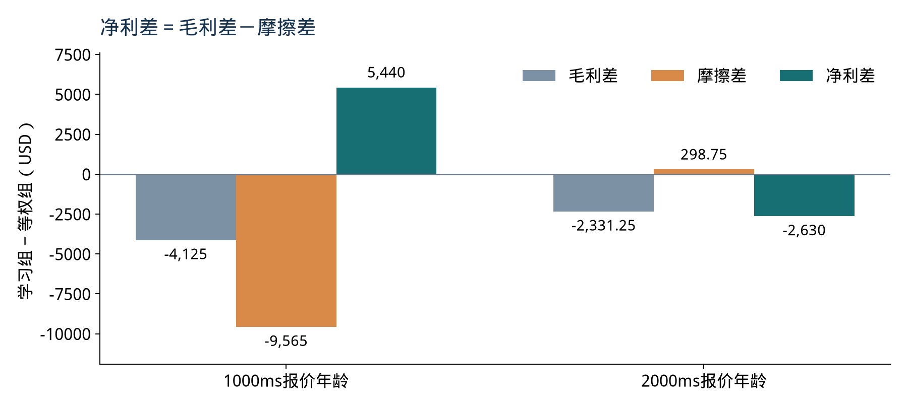

# FMATO 核心机制的课程部分复现

本报告支撑10分钟小组展示。研究问题是：在相同执行与成本条件下，多尺度成交后评价驱动的动态模型选择，是否优于固定模型和均值集成？主结果来自既有后段七日冻结复核。本次瘦身整理材料与运行入口，没有重新训练或替换历史收益。

目前观察到的结论是：所有已执行的非现金策略累计亏损，学习权重对等权 UCB 的影响随报价年龄改变，不能声称稳定有效，也不能据此否定论文在不同市场上的结果。

## 方法和原文对应

系统先用历史盘口训练多个轻模型。模型预测未来5秒相对收益；系统选择模型，其预测经过固定门槛形成交易意图，再按后来到达的行情成交。OE 从实际买卖成交时刻计算各前瞻期的中间价差。历史校准近似学习评分权重并冻结，UCB 根据此后已成熟的期间平均评分调整选择。

两种学习不同：IRL 近似解释历史专家的多尺度评分偏好，UCB 决定现在使用哪个预测模型。强化学习的动作是模型，奖励权重在评价阶段不重学；奖励是价格点，交易净利是扣成本后的美元。

校准比较矩阵保留现金、三个固定Ridge门槛参照和十二个库候选；专家只从库候选取，在线也只在十二个库模型间选择。最低一笔成熟订单仅保证可计算，不保证统计可靠。权重求出后仍需检查专家可表示及完整在线库观测，不能把求解成功直接当作可交易。

| 原文位置（PDF物理页） | 原方法 | 项目实现与差异 |
| --- | --- | --- |
| 第3页 §3.1、Eq.(1) | 动作对应预测模型 | 保留；采用12个预声明候选 |
| 第3–4页 §3.2、Table 2 | 轻线性/树模型，不同特征和历史、每周更新 | Ridge/浅树×价格/挂单深度/价量×1/2个历史session；公式、短历史、候选数是工程设定，挂单深度不等于成交量 |
| 第4页 Eq.(2)–(3) | 中间价差，多尺度权重和为1 | 七尺度5/15/45/135/405/1215/3645秒；保留原始价格差，不归一化、裁剪或扣费；卖单方向取反为项目扩展 |
| 第4页 Eq.(4)、Algorithm 1 | 专家与奖励学习 | 库内已平仓候选按校准净利选专家，有限完整候选最大间隔替代未公开生产优化器；权重可为负，第二阶段最小L1只是消歧 |
| 第5页 Eq.(5) | 固定期间全部订单平均评价 | 在线5分钟期间必须结束且全部订单七尺度完整成熟才更新；缺一单不取子集或补零。校准仅池化成熟订单子集，与原完整期间校准有差异 |
| 第5页 Eq.(6)、Algorithm 2 | UCB兼顾奖励与探索 | 实现相应分数；期间内锁定模型、访问与反馈计数分开、周版本分开统计是明示工程约定，C=1价格点不按后段调参 |
| 第5页 Algorithm 3、第5–10页实验 | ARS及原市场/基线/耗时对照 | 历史变体结果保留但退出课程主讲与当前回放；中国期货实盘、原收益、完整原基线与交易链路耗时尚未复现 |
| 第4–5页 Eq.(2)–(6)、第7–8页费用实验 | 原奖励使用中间价差，收益与手续费另列 | 新增独立费用内化OE实验：共用原校准权重，奖励减本次实际单边摩擦的价格点值；属于我们的扩展，原方法和历史结果保留 |

论文对0.5秒与每秒四次快照的叙述存在差异。本项目显式使用500ms网格，不把它等同于原文所有 tick 描述。最长奖励观察约60.75分钟，和模型预测5秒、选择期间5分钟、持仓复核15秒分别属于不同时间量。

## 数据与实验条件

行情来自 Databento 的 GLBX.MDP3 / MBP-10 / ESZ5。新数据索引覆盖2025-09-15至12-15（不含末日）的78个 UTC 日期、714385685条记录；09-17、09-24、11-28标记 degraded。UTC分区不等于交易 session，完整夜盘可能需要相邻文件。此数据与论文中国商品期货市场不同。

现有证据共涉及21个不同session。10-02/03启动训练，10-06至10-10五日校准，10-13至10-21七日开发评价，10-22至10-30七日冻结复核。全部日期已用于开发，不追认未触碰测试。后段周版本10-20和10-27分别用之前已结束的16/17日、23/24日训练；奖励继承原校准后冻结。

主表五项同时使用完整库的当时预测可用性、相同主动成交和成本条件。固定候选为提前声明的 `Ridge-price-h1` 身份，参数按周更新，并非事后收益最好的模型。均值集成取12个预测的平均；等权OE-UCB用于区分学习权重的作用。全部500/1000/2000ms报价年龄同时报告，没有从收益反选质量口径。

接收时间严格早于决策网格，只有完整事件末尾、合法盘口和足够新的报价进入快照。缺格、暂停和跨session不任意前填，滚动特征重新预热。标准化只用历史，训练边界按最长前瞻隔离；未来中间价只用于到期评价，不用于提前更新或筛选当时决策。

每次模拟交易1张ES，点值50美元，最小跳动0.25点，单边手续费1.25美元，买卖一之外增加0.5跳不利滑点；信号延迟500ms，持仓至少每15秒复核。点差、滑点、手续费进入摩擦，净利=毛利−摩擦。未模拟排队、冲击或保证金。每日账户按10万美元独立重启，不连续复利，也不据此年化夏普。

## 七日主结果

日期为10-22/23/24/27/28/29/30；以下为独立日净利加总，单位USD。

| 策略 | 500ms报价年龄 | 1000ms报价年龄 | 2000ms报价年龄 |
| --- | ---: | ---: | ---: |
| 现金 | 0.00 | 0.00 | 0.00 |
| 固定库候选 | -33045.00 | -34647.50 | -62810.00 |
| 均值集成 | -22205.00 | -33505.00 | -38120.00 |
| 等权OE-UCB | -94952.50 | -79985.00 | -104410.00 |
| 学习权重OE-UCB | 阻断 | -74545.00 | -107040.00 |

全部执行的非现金策略累计亏损，动态组没有优于必要参照。相对等权，学习组在1000ms少亏5440美元，在2000ms多亏2630美元，方向不稳定。1000ms差异由毛利更差4125美元、摩擦减少9565美元组成；不能据此声称预测更准确。

500ms校准最佳库内专家834笔成交中，完整成熟OE为0笔，且完整库观测不足，学习组阻断。1000/2000ms该专家分别仅有4/22笔成熟订单；“专家”只是候选内净利最高者，仍亏损。每尺度有样本不代表联合七尺度完整，求解或门控成功不等于盈利或统计充分。

## 论文的不足与我们的增量改进

论文的多尺度OE评价成交后的价格走势，未在奖励中显式扣除交易摩擦；原文确实另列收益和手续费，也做了实盘实验。我们的唯一方法改进是将奖励改为“原OE减本次模拟成交摩擦美元÷（50美元每点每张×张数）”，原校准权重、模型、UCB、七尺度成熟与执行条件共用。

独立新回放的后段七日结果如下，单位USD；原OE对照的逐日财务和成交计数与旧快照一致。原五策略主表、历史图和原结论继续保留。

| 报价年龄 | 原学习OE净利 | 费用内化OE净利 | 净利差 |
| --- | ---: | ---: | ---: |
| 500ms | 阻断 | 阻断 | 未定义 |
| 1000ms | -74545.00 | -63890.00 | 10655.00 |
| 2000ms | -107040.00 | -99200.00 | 7840.00 |

后段改善中，1000ms为毛利增加4725美元、摩擦减少5930美元；2000ms为毛利增加475美元、摩擦减少7365美元。前段1000ms反而多亏492.50美元，所有执行组仍亏损，因此不能声称稳定盈利或预测更准确。两阶段全部结果、公式、限制和独立新证据见 [费用内化奖励报告](friction_reward_report.md)。

## 如何解释与核查

当前信号、交易摩擦、稀疏完整反馈、短历史和替代市场都可能限制结果。本实验没有识别各因素的独立因果贡献；七日且多口径共用行情，也不足以作统计显著性或长期收益推断。现金不交易所以净利为零，阻断表示未执行，收益应是 `null`。

组员根据本报告的方法、主表和配图制作 PPT 与讲稿，并计时排练。展示摘要与两张课程图由 [冻结快照](results/final_report/frozen_ablation_snapshot.json)提取；另外两批结果、扩展策略和原始图见 [证据目录](results/final_report/README.md)，三份快照与两图按原字节保留。历史源码身份对应原提交，不更新成当前代码哈希。

`python -S scripts/check_project.py`核对身份、金额、加总、图表及文档引用；`python run_project.py check --core`加做小合成的未来扰动、完整期间成熟和账本检查。这些检查支持指定性质，不证明盈利、原行情真实性或原论文等价复现。新入口重跑另存新身份，当前报告始终描述既有证据。
