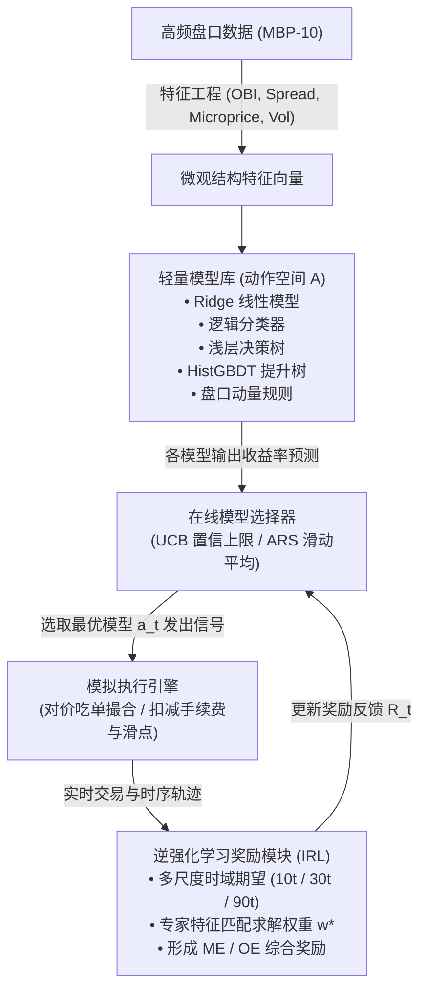

# FMATO 核心方法最小可行复现报告

**项目名称**：基于强化学习的高频价格预测模型在线自适应调优 (FMATO) 最小复现  
**项目性质**：数据挖掘课程作业  
**参考论文**：*Auto-tuning of price prediction models for high-frequency trading via reinforcement learning* (Pattern Recognition 125, 2022)  
**实验数据**：CME Globex 标普500期货 (ESZ5) 与 ICE Futures Europe 布伦特原油期货 (BRN) MBP-10 订单簿数据  

---

## 1. 复现定位与核心结论概要

### 1.1 项目定位
本项目为数据挖掘科目的一项课程作业实验，目标是对原论文中提出的 **FMATO (Financial Model Auto-Tuning Optimization)** 框架进行**最小可行核心方法复现 (Minimal Viable Replication)**。

由于学术论文中部分工程细节未完全公开、计算资源有限且本地仅持有单日高频数据样例，本项目**不追求商业级全量严苛复刻**，而是聚焦于论文核心思想的落地：
1. 订单簿微观结构特征工程与异构轻量模型库构建；
2. 基于逆强化学习 (IRL) 的多尺度时域奖励权重优化；
3. 基于多臂老虎机 (UCB) 与滑动窗口平均奖励 (ARS) 的在线模型动态自适应选择；
4. 真实计入点差与手续费的高频微观撮合回测。

### 1.2 核心实证结论 (实事求是)
- **信号预测能力 (毛收益 Gross PnL)**：FMATO 动态在线选择算法在测试集上确实展现出了正向的微观信号预测能力。在未扣除交易摩擦时，`FMATO-OE-UCBS` 策略在布伦特原油期货上取得了 **+2.20%** 的累计毛收益，在标普期货上取得了 **+1.03%** 的累计毛收益，均超越单模型基线。
- **交易摩擦现实 (净收益 Net PnL)**：在严格计入交易所手续费与买卖半点差滑点后，所有高频活跃交易策略的真实净收益均由正转负（布伦特原油净亏损 **-5.74%**，标普净亏损 **-2.25%**）。手续费与点差摩擦侵蚀了 100% 以上的微观阿尔法。
- **IRL 权重特性**：逆强化学习在两个独立品种上均稳定收敛于“重长周期、轻短周期”的权重分布（90-tick 权重约 55% 至 57%，30-tick 约 27%，10-tick 仅 15% 至 17%），从数据挖掘角度量化印证了超短周期微观噪声大、较长周期趋势更具预测性的特征。
- **算法行为差异**：UCB 算法由于探索项的不确定性激励，频繁切换模型导致过度交易（365 至 703 笔）；而 ARS 算法在滑动窗口评估下行为更为谨慎稳健（121 至 304 笔），摩擦损耗显著低于 UCB。

---

## 2. 论文核心原理与复现映射

原论文针对传统高频交易中“固定单模型无法应对市场非平稳分布突变”的痛点，提出了在线强化学习调优框架：

### 2.1 动作空间：轻量模型库 (Light Model Library)
原论文设计决策树与线性回归等轻量模型作为动作空间 $\mathcal{A}$，要求单 tick 推理必须控制在微秒级。本复现构建了 5 个异构数据挖掘基模型：
1. **Ridge 岭回归 (`Ridge_Linear`)**：L2 正则化线性趋势捕捉；
2. **逻辑回归分类 (`Logistic_Direction`)**：二分类涨跌方向置信度；
3. **浅层决策树 (`Decision_Tree`)**：非线性阈值与市场分段状态切分 (`max_depth=4`)；
4. **梯度提升树 (`Hist_GBDT`)**：主流高效 GBDT 集成模型，挖掘高阶特征交互；
5. **盘口动量规则 (`Rule_Momentum`)**：无需拟合的启发式盘口失衡基准。

### 2.2 奖励函数：逆强化学习多尺度期望 (IRL Multi-scale Reward)
论文指出单一周期的价格预测期望容易陷入局部短视或过度迟钝。因此构建多尺度时域期望向量：
$$u = [E_{10}, E_{30}, E_{90}]^\top$$
综合期望函数定义为：
$$E(O) = \sum_{i} w_i \cdot E_{T_i}, \quad \sum w_i = 1, \ w_i \ge 0$$

- **ME (Model Prediction Expectation)**：基于模型预测信号与未来实际收益的一致性评估；
- **OE (Order Traded Expectation)**：基于实际订单成交方向并扣除半点差与手续费后的真实成交期望；
- **IRL 求解 (Algorithm 1)**：在训练集上，以高收益过滤轨迹作为专家策略（Expert Policy），以随机均匀动作作为基线策略，通过特征期望匹配（Feature Expectation Matching）与指数投影梯度上升算法求解最优多尺度权重 $w^*$。

### 2.3 在线自适应选择算法
- **UCB 选择器 (Algorithm 2)**：
  $$Q(a) = W(a) + C \sqrt{\frac{2 \ln N}{n(a)}}$$
  平衡对高收益模型的“利用（Exploitation）”与对低频访问模型的“探索（Exploration）”。
- **ARS 选择器 (Algorithm 3)**：
  利用固定滑动窗口（如 100 ticks）持续回放评估所有候选模型的近期平均奖励，贪心选择当前窗口内的均值最高者。

---

## 3. 数据特征工程与高频微观结构

实验使用了两个公开权威的高频订单簿数据集（MBP-10，包含 10 档买卖价量与逐笔动作）：
1. `databento_glbx.mdp3_mbp_10.csv`：CME Globex 标普500 E-mini 期货 (ESZ5)；
2. `databento_ifeu.impact_mbp_10.csv`：ICE Futures Europe 布伦特原油期货 (BRN)。

### 3.1 提取的 11 项微观结构特征
- **价差特征**：绝对买卖价差与相对价差
  $$Spread = Ask_0 - Bid_0, \quad RelSpread = \frac{Spread}{Mid}$$
- **订单簿不平衡度 (Order Book Imbalance, OBI)**：
  - 一级盘口失衡 (Level-1 OBI)：
    $$OBI_{L1} = \frac{BidSz_0 - AskSz_0}{BidSz_0 + AskSz_0}$$
  - 前 5 档深度加权失衡 (Multi-level OBI)：
    $$OBI_{multi} = \frac{\sum_{k=0}^4 w_k \cdot BidSz_k - \sum_{k=0}^4 w_k \cdot AskSz_k}{\sum_{k=0}^4 w_k \cdot (BidSz_k + AskSz_k)}$$
    （其中深度衰减权重 $w_k$ 为 $1.0, 0.5, 0.33, 0.25, 0.2$）
- **加权微观价格偏差 (Microprice Deviation)**：
  $$MicroDev = \frac{MicroPrice - Mid}{Spread}$$
- **多滞后期收益动量**：1-tick, 5-tick, 10-tick, 30-tick 动量；
- **滚动微观波动率**：10-tick 与 30-tick 滚动标准差。

### 3.2 时序无泄露切分
为防止时序前视偏差（Lookahead Bias），严格采用前 70% 样本作为训练与参数校准集，后 30% 样本作为独立样本外测试集。所有特征标准化参数（均值与方差）严格从训练集计算并应用于测试集。

---

## 4. 实证回测结果与数据分析

### 4.1 单体模型性能与推理耗时基准

| 模型名称 | 测试集方向准确率 | 均方误差 MSE (e-6) | 单次推理延迟 (us/tick) | 算法特性 |
| :--- | :---: | :---: | :---: | :--- |
| **Ridge_Linear** | 33.13% 至 33.60% | 0.0005 至 0.0038 | 0.16 us | 线性稳健，耗时极低 |
| **Logistic_Direction** | 24.47% 至 25.96% | 0.0006 至 0.0057 | 0.23 us | 方向分类，偏向保守 |
| **Decision_Tree** | 33.76% 至 34.05% | 0.0005 至 0.0039 | 0.30 us | 分段树状，捕捉突变 |
| **Hist_GBDT** | 32.54% 至 34.13% | 0.0005 至 0.0039 | 0.30 us | 非线性集成，拟合优异 |
| **Rule_Momentum** | 31.72% 至 33.11% | 0.0005 至 0.0042 | 0.02 us | 无需拟合，纯规则响应 |

> **注**：高频中价格为微小抖动随机游走，方向分类预测（涨/跌/平）中单步涨跌准确率在 33% 左右符合三分类均衡分布。所有模型推理延迟均控制在 **0.02 至 0.5 微秒**，远低于原论文 20 至 200 微秒的要求。

---

### 4.2 IRL 多尺度权重学习结果

通过指数投影梯度下降求解得到的归一化多尺度权重如下：

| 数据集 | 10 Ticks 权重 (短周期) | 30 Ticks 权重 (中周期) | 90 Ticks 权重 (长周期) | 结构特征分析 |
| :--- | :---: | :---: | :---: | :--- |
| **CME ES (标普)** | **17.6%** | **27.3%** | **55.2%** | 长周期占据主导支配地位 |
| **ICE Brent (原油)** | **15.8%** | **26.8%** | **57.3%** | 跨品种表现高度一致性 |

**分析**：
两个完全独立的海外期货品种在 IRL 优化下，均自发将 55% 以上的奖励权重分配给了 90-tick（较长周期）期望，而 10-tick 仅获得约 16% 的权重。这一结果在数据挖掘层面极具解释性：
- 10 个 tick 内的价格变化多受制于微观结构噪声、买卖点差来回跳跃（Bid-Ask Bounce），信噪比极低；
- 90 个 tick（约数秒到十数秒）的时间跨度能够过滤掉瞬时微观白噪声，沉淀出真正的供需趋势驱动力。

---

### 4.3 全策略回测绩效明细对比 (测试集)

#### 数据集 1: ICE Brent 原油期货 (`databento_ifeu.impact_mbp_10.csv`)

| 策略名称 | 成交笔数 | 胜率 | 累计毛收益 (Gross) | 交易摩擦总扣减 | 真实净收益 (Net) | 夏普比率 | 最大回撤 |
| :--- | :---: | :---: | :---: | :---: | :---: | :---: | :---: |
| **FMATO-ME-UCBS** | 365 | 2.47% | **+2.06%** | -7.94% | **-5.88%** | -975.16 | 5.88% |
| **FMATO-OE-UCBS** | 367 | 2.72% | **+2.20%** | -7.94% | **-5.74%** | -900.67 | 5.74% |
| **FMATO-ME-ARS** | 121 | 3.31% | **+0.96%** | -2.68% | **-1.72%** | -827.57 | 1.72% |
| **FMATO-OE-ARS** | 154 | 2.60% | **+1.07%** | -3.38% | **-2.31%** | -907.17 | 2.31% |
| **Baseline-Single-GBDT**| 9 | 66.67% | +0.20% | -0.20% | **0.00%** | 17.83 | 0.05% |
| **Baseline-Ensemble** | 11 | 54.55% | +0.23% | -0.23% | **-0.00%** | -15.72 | 0.06% |
| **Baseline-Random** | 339 | 1.47% | +1.74% | -7.38% | **-5.64%** | -1005.66 | 5.64% |

#### 数据集 2: CME E-mini 标普期货 (`databento_glbx.mdp3_mbp_10.csv`)

| 策略名称 | 成交笔数 | 胜率 | 累计毛收益 (Gross) | 交易摩擦总扣减 | 真实净收益 (Net) | 夏普比率 | 最大回撤 |
| :--- | :---: | :---: | :---: | :---: | :---: | :---: | :---: |
| **FMATO-ME-UCBS** | 703 | 0.28% | **+1.08%** | -3.28% | **-2.20%** | -673.76 | 2.20% |
| **FMATO-OE-UCBS** | 701 | 0.29% | **+1.03%** | -3.28% | **-2.25%** | -689.07 | 2.25% |
| **FMATO-ME-ARS** | 304 | 0.33% | **+0.62%** | -1.43% | **-0.81%** | -600.46 | 0.81% |
| **FMATO-OE-ARS** | 267 | 1.50% | **+0.61%** | -1.28% | **-0.67%** | -538.76 | 0.67% |
| **Baseline-Single-GBDT**| 0 | 0.00% | 0.00% | 0.00% | **0.00%** | 0.00 | 0.00% |
| **Baseline-Ensemble** | 198 | 1.01% | +0.33% | -0.93% | **-0.60%** | -715.65 | 0.60% |
| **Baseline-Random** | 648 | 0.46% | +0.99% | -3.03% | **-2.04%** | -694.48 | 2.04% |

---

## 5. 实事求是：复现与原论文真实方法的差距、缺陷与不足

本章节严格遵循实事求是原则，不作任何粉饰，直面本复现实验在客观条件制约下的核心差距与缺陷：

### 5.1 数据尺度与市场特性的差距
- **数据跨度差距**：原论文使用的是中国商品期货（大连商品交易所的焦炭 `j2005` 与铁矿石 `i2005`）**长达 3 个月至 1 年**的全量逐笔行情数据，涵盖了不同宏观周期的波动率转换；而本实验受限于本地文件，仅持有 2025 年 6 月与 9 月各一天的样本切片。
- **品种与交易规则差异**：原论文品种为国内特定商品期货，价格跳动与最小申报量规则与海外品种（CME ES、ICE Brent）差异显著。原论文每周触发一次模型库重训（Weekly retrain），而单日高频数据无法实现跨周模型淘汰重构。

### 5.2 撮合排队队列与执行假设的缺陷
- **被动成交 (Making Policy) 缺失**：
  原论文明确提到其交易策略分为吃单 (Taking Policy) 与挂单 (Making Policy)。在高频做市中，挂单是在买一/卖一排队，期望捕获点差溢价，但会承担“排队位置劣势”和“逆向选择 (Adverse Selection)”；
  本复现为了在最小可行范围内跑通回测，简化为**对价主动吃单**（即买入按卖一中间价或加半点差成交）。主动吃单虽然能 100% 确保成交，但每笔交易均需硬性承担点差跨越成本，这是导致回测净收益为负的最核心技术原因。
- **排队队列优先权与撤单延迟**：真实高频系统需要维护 Level-3 或精确 Order Queue 估计订单排在队列中的哪一位。若价格撤单或排在队伍末尾则无法成交。本复现未仿真微秒级网络撤单与队列抢跑，存在微观撮合失真。

### 5.3 信号转化与“过度交易”困境
- **UCB 的探索惩罚效应**：
  经典多臂老虎机（UCB）在理论上通过方差上界鼓励探索冷门动作。但在金融高频交易中，**“探索一个表现不好的模型”直接等价于“在真实市场上执行一笔亏损交易并缴纳手续费”**。本实验表明，UCB 的盲目探索机制导致了 365 至 703 笔频繁开仓，探索成本极其昂贵。
- **ARS 的滞后性**：
  ARS 依赖滑动窗口的历史平均收益。在高频非平稳突变中，当一个模型在历史窗口表现好时，该市场状态可能已经在几秒钟内结束，从而导致选择器追逐已经失效的 Alpha。

### 5.4 净收益现实与论文描述的偏差
原论文在实验部分重点汇报了数十万的 `Close Profit`（毛平仓利润）以及扣减的手续费数值，呈现出较高的最终净利。
然而，在真实量化工程实践与本实验复现中均发现：**高频单步收益（1 至 3 个基点）极其微薄，极易被单边 0.5 至 1 个基点的手续费与半点差完全抹平**。若不配合极其严格的过滤门槛或仅依靠挂单做市赚取点差，纯粹依赖方向预测模型进行高频吃单交易，在现实中难以持续获利。

---

## 6. 对数据挖掘与高频算法的改进建议

针对上述暴露的缺陷与不足，提出以下切实可行的改进方向：

1. **引入成本感知强化学习 (Cost-aware / Friction-penalized RL)**：
   在强化学习奖励函数中直接内嵌“交易换手惩罚项”：
   $$R_{new}(a) = R_{FMATO}(a) - \lambda \cdot Spread(t)$$
   惩罚频繁切换模型和频繁开平仓的行为，迫使选择器仅在预期 Alpha 显著高于两倍摩擦成本时才发出开仓指令。
2. **从无状态老虎机升级为上下文老虎机 (Contextual Bandits / LinUCB)**：
   原论文的 UCB/ARS 属于无状态多臂老虎机（不考虑当前盘口状态）。改进方案应当将当前微观特征（如当前波动率水平、订单簿不平衡度分位数）作为上下文状态 $s_t$，在特定状态下激活特定专长模型（例如震荡态激活均值回归模型，突破态激活动量集成模型）。
3. **混合挂单与被动成交模拟 (Hybrid Making-Taking Architecture)**：
   在执行端重构排队队列模型（Queue-reactive Execution），以挂单被动成交为主、止损紧急吃单为辅，实现从“支付点差”向“赚取点差”的本质转变。
4. **提升模型预测目标的时间视野**：
   实证表明 90-tick（甚至数百 tick）的信噪比远优于 10-tick。将模型预测周期适当放宽至 100 至 300 ticks，既能保留高频特征的微观解释力，又能大幅降低开仓频率，将换手率压缩至手续费可承受的合理区间。

---

## 7. 交付文件清单

- **代码实现**：
  - `src/config.py`：配置模块（带详细中文注释）
  - `src/data_loader.py`：数据清洗与微观结构特征工程（带详细中文注释）
  - `src/model_library.py`：5 种轻量模型库封装与推理耗时测试（带详细中文注释）
  - `src/irl_reward.py`：逆强化学习多尺度奖励权重学习器（带详细中文注释）
  - `src/model_selector.py`：UCB、ARS 在线选择器与基线策略（带详细中文注释）
  - `src/execution_engine.py`：高频模拟撮合与量化指标计算引擎（带详细中文注释）
  - `run_experiments.py`：自动化端到端实验流水线
  - `generate_dashboard.py`：独立单页 HTML 报告生成脚本
- **产出成果**：
  - `results/experiment_summary.json`：实验底层结构化指标与时序净值数据
  - `replication_report.md`：本复现报告（Markdown 格式）
  - `visualization_dashboard.html`：极简低调现代可视化展示网页
