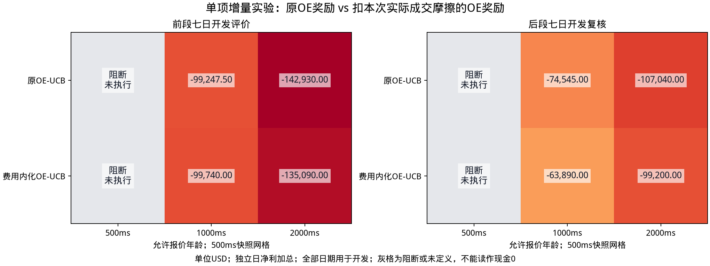

# 费用内化奖励增量实验

两方法共用原校准权重、模型、UCB与执行条件，唯一处理是奖励减本次实际单边摩擦。全部日期已用于开发；原历史证据另行保留。金额单位USD，差值为扩展减原OE。

## 前段七日开发评价

| 报价年龄 | 原OE净利 | 费用内化OE净利 | 净利差 | 毛利差 | 摩擦差 | 成交数差 |
| --- | ---: | ---: | ---: | ---: | ---: | ---: |
| 500ms | 阻断/未定义 | 阻断/未定义 | 阻断/未定义 | 阻断/未定义 | 阻断/未定义 | 未定义 |
| 1000ms | -99247.50 | -99740.00 | -492.50 | -431.25 | 61.25 | 4 |
| 2000ms | -142930.00 | -135090.00 | 7840.00 | -537.50 | -8377.50 | -602 |

## 后段七日开发复核

| 报价年龄 | 原OE净利 | 费用内化OE净利 | 净利差 | 毛利差 | 摩擦差 | 成交数差 |
| --- | ---: | ---: | ---: | ---: | ---: | ---: |
| 500ms | 阻断/未定义 | 阻断/未定义 | 阻断/未定义 | 阻断/未定义 | 阻断/未定义 | 未定义 |
| 1000ms | -74545.00 | -63890.00 | 10655.00 | 4725.00 | -5930.00 | -434 |
| 2000ms | -107040.00 | -99200.00 | 7840.00 | 475.00 | -7365.00 | -522 |

净利差=毛利差−摩擦差；阻断/未定义不是现金零收益。
